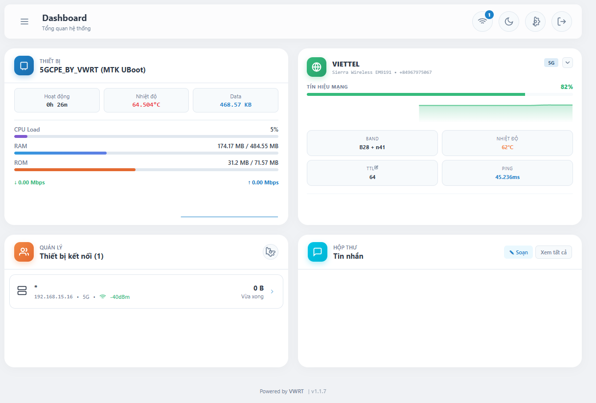

# 🚀 VWRT Dashboard System (VWRT Admin Panel)

> **Hệ thống quản lý Router OpenWrt chuyên dụng, tối ưu hóa cho Modem 4G/5G.**

---

## 🔴 CẢNH BÁO BẢN QUYỀN (EXCLUSIVE NOTICE)

📞 **Liên Hệ & Hỗ Trợ**

- Mọi thông tin chi tiết vui lòng liên hệ qua các kênh chính thức dưới đây:

**👨‍💻 TÁC GIẢ CỦA [Vietter](https://www.facebook.com/vietter.99/)**

**🆘 HỖ TRỢ & GIẢI ĐÁP (Support) [Phạm Việt](https://www.facebook.com/pham.viet.853811)**

**© 2026 VWRT. All rights reserved.**

---

⚠️ **QUAN TRỌNG:**

- Sản phẩm được thiết kế và tối ưu riêng cho các thiết bị phần cứng do chúng tôi cung cấp/hỗ trợ.
- Nghiêm cấm mọi hành vi sao chép, chỉnh sửa, phân phối lại hoặc sử dụng cho mục đích thương mại mà không có sự đồng ý của tác giả.

---

## ✨ Tính Năng Nổi Bật (Features)

Hệ thống VWRT Dashboard mang đến trải nghiệm quản lý Router hoàn toàn mới:

### 1. 📊 Dashboard Trực Quan

- **Giao diện thẻ (Card-based):** Hiện đại, dễ nhìn.
- **Responsive:** Tương thích hoàn hảo trên cả PC & Mobile.
- **Theme:** Hỗ trợ Dark Mode / Light Mode.

### 2. 📡 Giám Sát Modem 4G/5G

- **Tối ưu hóa:** Hỗ trợ tốt dòng cardwwan sài mmcli.
- **Thông số chi tiết:** Hiển thị Real-time: RSRP, SINR, Band, CA, Nhiệt độ Modem...

### 3. 📩 Quản Lý Tin Nhắn & Hệ Thống

- **SMS:** Đọc và Gửi tin nhắn/USSD ngay trên Web.
- **Tiện ích:** Theo dõi CPU/RAM, Reboot, Reset, Đổi cổng Modem nhanh.

### 4. 🔄 Cập Nhật Tự Động (OTA)

- Tự động kiểm tra và thông báo khi có phiên bản mới từ Server.
- Hỗ trợ cập nhật riêng biệt Dashboard.

### 5. 🛠️ Tự Động Phục Hồi Mạng (Auto Recovery)

- **Watchdog & TimeWrt:** Tối ưu hóa cho SIM Bypass/Hack Data.
- **ISP DNS Sync:** Tự động lấy giờ qua DNS nhà mạng ngay cả khi bị chặn DNS quốc tế.
- **Auto Restart:** Tự động khởi động lại VPN khi phát hiện mất kết nối hoặc lệch giờ.

### 6. 📝 Nhật Ký Tập Trung (Integrated Logs)

- Theo dõi trạng thái hoạt động của Proxy và hệ thống phục hồi mạng tại cùng một Tab nhật ký.
- Giúp dễ dàng chẩn đoán và xử lý sự cố kết nối.

---

---
